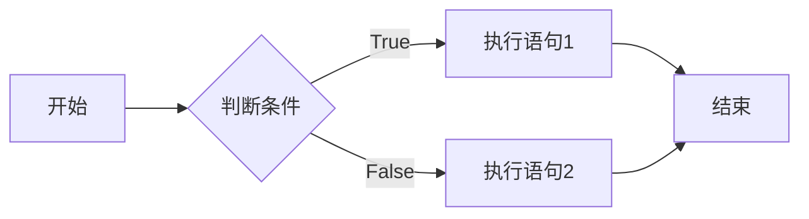
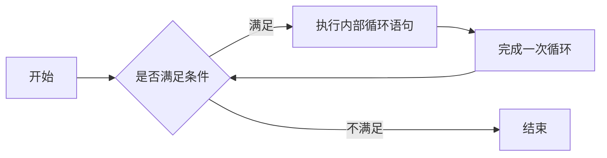
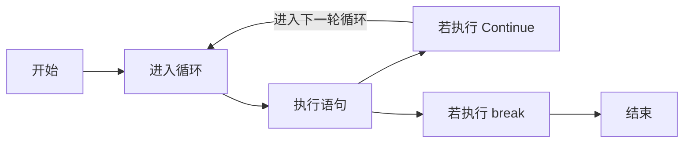


本篇为作者几年前写的 Python 快速入门学习笔记，适合初学者学习。


# I. 「安装篇」

## 一、下载安装 Python

- 官网下载
  
  - Windows：
    
    
  
  - Mac OS：
    
  
  - Linux：**现如今发行版基本内置，无需下载安装**

## 二、下载 IDE（集成开发环境）

- Jetbrain Pycharm (**👍 非常值得建议初学者使用**)
  

- Visual Studio Code
  

- Sublime Text
  

# II.「基础篇」

## 一、使用 Python

### 1. 交互式 Python（IDLE）

1. 如何查看版本
   
   ```
   $ python --version
   Python 3.10.6
   ```

2. 如何进入 Python
   
   ```
   $ python
   Python 3.10.6 (main, Aug  2 2022, 00:00:00) [GCC 12.1.1 20220507 (Red Hat 12.1.1-1)] on linux
   Type "help", "copyright", "credits" or "license" for more information.
   >>> 
   ```

3. 如何退出交互式 Python

    方法一：在交互式 Python 里输入 `quit()` 回车执行

    方法二：直接按下 <kbd>Ctrl</kbd> + <kbd>D</kbd> 退出（Windows 下需先按下 <kbd>Ctrl</kbd> + <kbd>Z</kbd> 再按下回车即可）

### 2. 如何编写 Python 脚本

- 新建 `helloWorld.py` 脚本文件

- 编写脚本
  
  ```python
  # Hello world！ 
  # 这是行注释
  '''
  这里是多行注释
  这里是多行注释
  这里是多行注释
  ------------
  重要的话说三遍
  '''
  
  # 这是主程序的入口
  if __name__ == '__main__':
      print('Hello world!')  # 输出打印
      name = 'Amy'
      print(f'Hello, {name}!')
  ```

- 执行脚本
  
  ```bash
  python helloWorld.py 
  ```

## 二、变量

1. 无需声明（定义），直接赋值；变量可直接覆盖
   
   ```python
   >>> x=5
   >>> print(x)
   5
   >>> x=8
   >>> print(x)
   8
   ```

2. 可同时赋值给多个变量
   
   ```python
   >>> x1 = x2 = x3 = 0
   >>> print(x1, x2, x3)
   0 0 0
   >>> y1, y2, y3 = 1, 2, 3
   >>> print(y1, y2, y3)
   1 2 3
   ```

3. 变量命名规则

| 正确命名      | 错误命名                   |
| --------- | ---------------------- |
| x         | x<mark>-</mark>ray     |
| Y         | <mark>for</mark>       |
| VariABle  | <mark>3</mark>dm       |
| p1l2      | <mark>!</mark>r3       |
| \_abc     | <mark>$</mark>w8       |
| user_name | app<mark>  </mark>name |

根据如上表格，可以确定：

- 变量名不能直接以数字为头

- 变量名开头可以以 `_` 为头，但不能使用其它特殊符号。

- 关键字不可直接作为变量名

- 变量名可包含 `_` 特殊字符，但不可包含空格、`-`、`$`、`!`等特殊字符。

3. 赋值并代入
    示例 1：定义变量并输出
   
   ```python
   >>> x=3
   >>> y=8*2
   >>> x+y
   19
   >>> 
   ```
   
   > Python 支持的算术运算符：`+` `-` `*` `/` `**` `//` `%`
   
   示例 2：结合代入计算
   
   ```python
   >>> a=10
   >>> a+=5    # a=a+5
   >>> a
   15
   >>> a-=5    # a=a-5
   >>> a
   10
   >>> a*=5    # a=a*5
   >>> a
   50
   >>> a/=5    # a=a/5
   >>> a
   10.0
   >>> a=10
   >>> a**=2    # a=a**2
   >>> a
   100
   >>> a%=40    # a=a%40
   >>> a
   20
   ```

## 三、数据类型

1. 数据类型示例表

| 数据类型    | 内容        | 示例                                |
| ------- | --------- | --------------------------------- |
| int     | 整型        | 3                                 |
| float   | 小数        | 3.14                              |
| complex | 复数        | 3+5**j**                          |
| bool    | 布尔（真假）    | <mark> **T**rue,**F**alse </mark> |
| str     | 字符串       | 'aaa'，“bbb”                       |
| byte    | ASCII 字符串 | b'abc'                            |
| list    | 列表        | <mark> [1,2,3] </mark>            |
| tuple   | 元组        | <mark> (4,5,6) </mark>            |
| dict    | 字典（关联数组）  | {'one' : 1, 'two' : 2}            |
| set     | 集合        | {'apple','banana'}                |
| range   | 范围        | range(10)                         |
| class   | 类         | Math                              |

2. **如何确定数据类型**  `type(<value>)`
   示例：
   
   ```python
   >>> type(30)
   <class 'int'>
   >>> type('abc')
   <class 'str'>
   >>> s = 'apple'
   >>> type(s)
   <class 'str'>
   >>> 
   ```

3. 强制转换数据类型（仅部分）

| 函数               | 作用                |
| ---------------- | ----------------- |
| int(x [,base ])  | 将x转换为一个整数         |
| long(x [,base ]) | 将x转换为一个长整数        |
| float(x)         | 将x转换到一个浮点数        |
| str(x)           | 将对象 x 转换为字符串      |
| **chr(x)**       | **将一个整数转换为一个字符**  |
| unichr(x)        | 将一个整数转换为Unicode字符 |
| **ord(x)**       | **将一个字符转换为它的整数值** |
| hex(x)           | 将一个整数转换为一个十六进制字符串 |
| oct(x)           | 将一个整数转换为一个八进制字符串  |

## 四、条件与循环

### 1. 条件语句

- 流程图



- 简要格式
  
  ```python
  if <表达式1>:
      ....    # 当条件满足时
  [elif <表达式2>:
      ....    # 当条件满足时
  ....]
  [else:
      ....    # 当条件不满足时]
  ```
  
  > 注意：条件语句后加 `:` ，其次**注意缩进**

- 示例：使用条件语句
  
  ```python
  >>> a = 5
  >>> if a > 3: 'a > 3' # 判断 a 是否大于 3
  ... elif a < 3: 'a < 3'
  ... else: 'a = 3'
  ... 
  'a > 3'
  
  >>> if a == 3: # 判断 a 是否等于 3
  ...     'a ≠ 3'
  ... else:
  ...     'a = 3'
  ... 
  'a ≠ 3'  
  ```
  
  > 注意：判断条件是否相等用 `==` 表示，`=` 表示变量赋值

### 2. 运算符

- 算术运算符

| 运算符 | 名称     | 示例          |
| --- | ------ | ----------- |
| +   | 加      | 5 + 5 = 10  |
| -   | 减      | 10 - 5 = 5  |
| *   | 乘      | 2 * 5 = 10  |
| /   | 除（小数）  | 10 / 5 = 2  |
| //  | 整除（整数） | 20 // 3 = 6 |
| **  | 幂      | 2 ** 3 = 8  |
| %   | 余      | 10 % 3 = 1  |

- 比较运算符

| 运算符        | 含义              |
| ---------- | --------------- |
| a == b     | a 与 b 相等（值）     |
| a != b     | a 与 b 不相等（值）    |
| a > b      | a 大于 b          |
| a < b      | a 小于 b          |
| a >= b     | a 大于等于 b        |
| a <= b     | a 小于等于 b        |
| a is b     | a 与 b 相等（对象）    |
| a is not b | a 与 b 不相等（对象）   |
| a in b     | 元素 a 包含在列表 b 中  |
| a not in b | 元素 a 不包含在列表 b 中 |

- 逻辑运算符

| 运算符         | 含义                      |
| ----------- | ----------------------- |
| a **and** b | 若 a 与 b 都满足，就为 True     |
| a **or** b  | 若 a 与 b 中的任一方满足，就为 True |
| **not** a   | 若 a 不满足，就为 True         |

- **运算符优先级**
  算术运算符 > 比较运算符 > 逻辑运算符
  `**` > `* / // %` > `+ -` >  `< <= == != > >=` > `not` > `and` > `or` 

- 示例：针对逻辑运算符判断
  
  ```python
  >>> a = 18
  >>> if a >= 10 and a <= 20:
  ...     '10 <= a <= 20'
  ... else:
  ...     'a < 10 or a > 20'
  ... 
  '10 <= a <= 20'
  ```
  
  > 💡 提示：该示例代码中第 2 行里的条件可以简化成 `10 <= a <= 20`

### 3. 循环语句

- 流程图



- **for** 循环
  
  - 已知循环次数及部分元素
  
  - 示例 1：通过 元素 `i` 在 `range` 中循环
    
    ```python
    >>> for i in range(5): # 循环 5 次并保存到 i 中
    ...     print(i)       # 输出 i 里的内容
    ... 
    0
    1
    2
    3
    4
    
    >>> for i in range(1, 5): # 指定范围
    ...     print(i)       # 输出 i 里的内容
    ... 
    1
    2
    3
    4
    ```
    
    > 提示：`range` 函数表示范围，
    > 例：`range(5)`表示 `0 ~ 4` 之间 **（不包含 5）** 的数
    >        `range(1, 10)` 表示从 `1` 到 `9` **（不包含`10`）** 之间的数
    >         `range(1, 10, 2)` 表示从 `1` 到 `9` 之间的数，步长为 `2`
  
  - 示例 2：在循环中指定列表
    
    ```python
    >>> for i in [1,3,5,7]:
    ...     print(i)
    ... 
    1
    3
    5
    7
    ```
    
    > 提示：for 循环还可以对指定列表中的元素依次进行访问。

- **while** 函数
  
  - 在不知道循环次数及元素的情况下适用
  
  - 示例 1：使用 while 循环
    
    ```python
    >>> n = 0             # 设置变量 n 初始值
    >>> while n < 5:      # 当 n 小于 5 时，才循环
    ...     print(n)      
    ...     n += 1        # 每循环一次，增加 i 的值
    ... 
    0
    1
    2
    3
    4
    ```
    
    > 注意：使用 while 循环时，一定要增加变量 `n` 的值，否则会出现**死循环**！ 
    
    > 没用的知识：**写一个最简单的死循环**
    > 
    > ```python
    > while True:    # 设为 True 将一直循环
    >     # <具体执行的代码>
    >     print('loop')
    > ```

- 跳出循环与跳过循环
  
  - continue【跳过循环】
    
    - 当循环时执行此语句，将结束当前此次循环，并进入下一轮循环
  
  - break【跳出循环】
    
    - 当循环时执行此语句，整个循环都将结束
  
  - 流程图



- 示例：在 while 循环中跳出循环
  
  ```python
  >>> i = 0
  >>> while i < 10:         # 当 i 为 10 时，结束循环
  ...     i += 1
  ...     if i % 3 == 0:    # 当 i 为 3 的倍数时跳过此轮循环
  ...             continue
  ...     elif i % 8 == 0:  # 当 i 为 8 的倍数时结束循环
  ...             break
  ...     else:
  ...             print(i)
  ... 
  1
  2
  4
  5
  7
  ```

## 五、集合

### 1. 列表（Array）

- 创建列表
  
  ```python
  >>> a=[3,1,2,5,4,7,6]
  >>> b=['apple','banana','cat']
  >>> c=[]
  ```
  
  > **TIPS：如何快速创建列表**
  > 例 1：快速创建一个有5个元素均为 0 的列表
  > 
  > ```python
  > >>> x=[0]*5
  > >>> x
  > [0, 0, 0, 0, 0]
  > ```
  > 
  > 例 2：依靠 for 循环创建
  > 
  > ```python
  > >>> x=[i for i in range(20)]
  > >>> x
  > [0, 1, 2, 3, 4, 5, 6, 7, 8, 9, 10, 11, 12, 13, 14, 15, 16, 17, 18, 19]
  > ```
  > 
  > 例 3：按照指定条件并通过循环来创建列表
  > 
  > ```python
  > >>> num_array=[i for i in range(10) if i % 2 == 0]
  > >>> num_array
  > [0, 2, 4, 6, 8]
  > ```
  > 
  > 例 4：通过 if...else...语句并通过 for 循环来创建列表
  > 
  > ```python
  > >>> data=[n if n % 2 != 0 else 0 for n in range(1,21)]
  > >>> data
  > [1, 0, 3, 0, 5, 0, 7, 0, 9, 0, 11, 0, 13, 0, 15, 0, 17, 0, 19, 0]
  > ```

- 使用示例
  
  - 在已有的列表中增加一个新元素
    
    ```python
    # 在 a 列表里新增一个元素（5）
    >>> a = [1,2,3,4]    
    >>> a.append(5)
    >>> a
    [1, 2, 3, 4, 5]
    ```
  
  - 在已有的列表中仅删除第一次出现的元素
    
    ```python
    # 在 a 列表里删除一个元素（3）
    >>> a = [2,3,4,6,8,10] 
    >>> a.remove(3)
    >>> a
    [2, 4, 6, 8, 10]
    ```
  
  - 在已有的列表中修改（覆盖）一个新元素
    
    ```python
    # 在 a 列表中将'm'修改为'o'
    >>> a = ['p','y','t','h','m','n']
    >>> a[-2] = 'o'
    >>> a
    ['p', 'y', 't', 'h', 'o', 'n']
    ```
  
  - 查看数组里的单个数据
    
    ```python
    >>> a[1]
    1
    >>> a[6]
    6
    >>> a[-1]    # 等同于查看 a[6]
    6
    >>> a[-6]    # 等同于查看 a[1]
    1
    ```
  
  - 查看数组里的所有数据
    
    ```python
    >>> a
    [3, 1, 2, 5, 4, 7, 6]
    ```
  
  - 查看数组里的部分数据
    
    ```python
    >>> a[1:5]            # 查看a[1]~a[4]
    [1, 2, 5, 4]
    >>> a[:5]             # 查看a[0]~a[4]
    [3, 1, 2, 5, 4]
    >>> a[1:]             # 查看a[1]~a[6]
    [1, 2, 5, 4, 7, 6]
    >>> a[-5:-1]          
    [2, 5, 4, 7]
    >>> a[-3:]
    [4, 7, 6]
    >>> a[:-5]
    [3, 1]
    ```
  
  - 查看列表的总个数及列表内出现 3 的次数
    
    ```python
    >>> a = [3, 8, 6, 3]
    >>> len(a)
    4
    >>> a.count(3)
    2
    ```
  
  - 排列所有元素
    
    ```python
    >>> num = [3, 2, 1, 5, 8.3, 0.5, 2.17, 3.14]
    >>> num.sort()
    >>> num
    [0.5, 1, 2, 2.17, 3, 3.14, 5, 8.3]
    >>> w = ['Apple', 'pineapple', 'Banana', 'orange', 'Strawberry']
    >>> sorted(w)
    >>> w
    ['Apple', 'Banana', 'Strawberry', 'orange', 'pineapple']
    ```
    
    > 提示：列表内的数值从小到大排序；字符串按照 ASCII 码值排序
    > **注意：列表内必须为相同的数据类型才可进行排列！**

- **列表内置函数**

| 函数      | 用法                               | 作用                  |
| ------- | -------------------------------- | ------------------- |
| append  | list.append(`<value>`)           | 在尾部添加一个新元素          |
| insert  | list.insert(`<index>`,`<value>`) | 在第`index`位置中插入一个新元素 |
| remove  | list.remove(`<value>`)           | 删除第一次出现的元素          |
| del     | del(list[`<index>`])             | 删除第 `index` 个元素     |
| pop     | list.pop(`<index>`)              | 同 `del` 函数          |
| sorted  | sorted(list)                     | 所有元素**按从小至大顺序**重新排列 |
| sorted  | sorted(list, reverse = True)     | 所有元素**按从大至小顺序**重新排列 |
| sort    | list.sort()                      | **正向排列**所有元素        |
| reverse | list.reverse()                   | **反向排列**所有元素        |
| len     | len(list)                        | 查看列表内元素的总个数         |
| count   | list.count(`n`)                  | 查看元素`n`在列表内出现的次数    |
| clear   | list.clear()                     | 清空列表内的所有元素          |

### 2. 元组（Tuple）

> *元组与列表看起来相似，但两者之前存在微妙的差别。*

1. 包括元素时，**使用的符号不同**
   数组用`[`、`]`包括元素；元组用`(`、`)`包括元素
   示例1：定义列表 a 和元组 b，并使用 type 函数查看当前变量所使用的类型
   
   ```python
   >>> a=[1,2,3]
   >>> b=(1,2,3)
   >>> type(a)
   <class 'list'>
   >>> type(b)
   <class 'tuple'>
   ```

2. 列表里的元素可以修改，而**元组里的元素不可修改**
   示例2：接【示例1】并进行修改数组中的数据
   
   ```python
   >>> a[2]=4
   >>> b[2]=3
   Traceback (most recent call last):
     File "<stin>", line 1, in <module>
   TypeError: 'tuple' object does not support item assignment
   >>> a
   [1, 2, 4]
   >>> b
   (1, 2, 3)
   ```

### 3. 字典（Dictionary）

- 字典是一个无序、可变和有索引的集合。在 Python 中，字典用`{}`编写，拥有**键**和**值**。

- 创建字典
  示例 1：创建一个人的个人信息
  
  ```python
  person_Zhang = {'name':'张三', 'age':24, 'sex':'男'}
  ```
  
  示例 2：嵌套创建
  
  ```python
  person = {
      {'name':'张三','age':24,'sex':'男'},
      {'name':'李四','age':23,'sex':'男'},
      {'name':'王五','age':25,'sex':'男'},
  }
  ```

- 查看字典
  示例 1：查看字典里的所有内容
  
  ```python
  >>> person_Zhang
  {'name': '张三', 'age': 24, 'sex': '男'}
  ```
  
  示例 2：查看字典里某个键的值
  
  ```python
  >>> person['name']
  '张三'
  >>> person['age']
  24
  >>> person['sex']
  '男'
  ```

- 字典的相关用法

| 方法           | 描述                          |
| ------------ | --------------------------- |
| clear()      | 删除字典中的所有元素                  |
| copy()       | 返回字典的副本                     |
| fromkeys()   | 返回拥有指定键和值的字典                |
| get()        | 返回指定键的值                     |
| items()      | 返回包含每个键值对的元组的列表             |
| keys()       | 返回包含字典键的列表                  |
| pop()        | 删除拥有指定键的元素                  |
| popitem()    | 删除最后插入的键值对                  |
| setdefault() | 返回指定键的值。如果该键不存在，则插入具有指定值的键。 |
| update()     | 使用指定的键值对字典进行更新              |
| values()     | 返回字典中所有值的列表                 |


## 六、字符串（String）

### 1. 提取字符串

示例：定义 s 变量，并在 s 中提取字符串

```python
>>> s="Hello world!"
>>> s[2]
'l'
>>> s[6:]
'world!'
>>> s[:8]
'Hello wo'
>>> s[-6:]
'world!'
>>> s[:-7]
'Hello'
>>> s[6:11]
'world'
```

### 2. 连接字符串

- 一般情况下，**字符串与字符串之间**用`+`连接

- **对不同数据类型的数据不能直接用 `+` 连接**
  
  ```python
  >>> print("Number: " + 20)
  Traceback (most recent call last):
  File "<stdin>", line 1, in <module>
  TypeError: can only concatenate str (not "int") to str
  ```
  
  - 方法一：将数值部分强制转换成字符串类型
    
    ```python
    >>> print('my number: ' + str(20))
    my number: 20
    ```
  
  - 方法二：两方之间添加 `,`以连接
    
    ```python
    >>> print("你的年龄：",18)
    你的年龄： 18
    ```
  
  - 方法三：在字符串中用 `%` 进行插入
    
    ```python
    >>> print('Your age: %i' % 18) 
    Your age: 18
    ```
  
  - 方法四：格式化字符串
    
    ```python
    >>> age=18
    >>> print('Your age: {age}') 
    Your age: 18
    ```

### 3. 分割字符串

- split 函数
  
  - 例 1：分割包含空格的字符串
    
    ```python
    >>> s='I am a boy.'
    >>> s.split(' ')
    ['I', 'am', 'a', 'boy.']
    ```
  
  - 例 2：分割**两次**包含空格的字符串
    
    ```python
    >>> s='Welcome to New York!'
    >>> s.split(' ',2)
    ['Welcome', 'to', 'New York!']
    ```

## 七、函数与类

### 1. 函数

- 创建与执行自定义函数
  
  - 创建一个无参的函数
    
    ```python
    # 函数的创建
    >>> def print_Hello():        # def 函数名():
    ...     return 'Hello world!' #     return <返回值>
    ... 
    
    # 函数的执行
    >>> print_Hello()
    'Hello world!'
    ```
  
  - 创建一个有参（包含一个或多个）的函数
    
    ```python
    # 设计一个从 1 加到 n 的函数
    >>> def getsum(n):
    ...     sum = 0    # 用于计算累加的总和
    ...     for i in range(1,n+1):# 设置从 1 到 n 的循环
    ...           sum += i        # 累加
    ...     return sum    # 返回累加结果
    ... 
    >>> getsum(10)   # 将 10 这个数传递到函数中
    55
    >>> n = 20
    >>> getsum(n)    # 将 n 值传递到函数中
    210
    ```
    
    ```python
    # 设计一个 a 与 b 相加的函数
    >>> def add(a,b):
    ...     return a+b
    ... 
    >>> add(3,6)
    9
    ```

- 思考 1：若执行下列代码，会得到什么输出结果？
  
  ```python
  n = 10
  def add_n(n):
      n += 10
      return n
  print(n)
  print(add_n(n))
  print(n)
  ```
  
  ```python
  a = [0]
  def cal(a):
      a[0] += 10
      return a
  print(a)
  print(cal(a))
  print(a)
  ```

- 思考 2：若执行下列代码，会得到什么输出结果？
  
  ```python
  def print_it():
      print("hello")
      print_it()
  
  print_it()
  ```
  
  ```python
  def count(num):
      num += 1
      if num < 10: print(count(num))
      return num
  
  num = 1
  print(count(num))
  ```

- 全局变量
  
  - 问题 1：若执行下列代码，会输出什么结果？
    
    ```python
    x = 5
    
    def add():
        a = 10
        print(x)
        print(a)
    
    add()
    print(x)
    print(a)
    ```
  
  - 输出结果：a 变量未定义
    
    ```
    发生异常: NameError
    name 'a' is not defined
    ```
  
  - 局部变量与全局变量的区别
    
    - 局部变量：只能在函数内部进行访问
    
    - 全局变量：既能在函数内部，还能在函数外部访问，定义时前面应添加`global`作为前缀
  
  - 解决办法：将 a 变量设置为全局变量
    
    ```python
    x = 5
    
    def add():
        global a    # 设置 a 为全局变量
        a = 10
        print(x)
        print(a)
    
    add()
    print(x)
    print(a)
    ```
  
  - 问题 2：若执行下列命令，会输出什么结果？
    
    ```python
    n = 30
    
    def update():
        n += 10
        return
    
    update()
    print(n)
    ```
  
  - 输出结果：由于函数中的变量 n 被程序认为是局部变量，并且在函数中没有定义变量 n
    
    ```
    发生异常: UnboundLocalError
    local variable 'n' referenced before assignment
    ```
  
  - 解决方法：在函数内部定义局部变量 n
    
    ```python
    n = 30
    
    def update():
        global n
        n += 10
        return
    
    update()
    print(n)
    ```

### 2. 类

- python 是一种**面向对象**的语言

- 面向对象：将数据和操作集中起来一起处理

- 类与实例的关系

- 结构：
  
  ```python
  class className:
      def def_1(args):
          .....
      def def_2(args):
          .....
      ....
  ```

- 例 1：定义 Users 类并创建实例。实现简单的登录与注销
  
  ```python
  class Users:
      def __init__(self,name,password):
          self.name=name
          self.password=password
      def login(self,password):    
          if self.password=='000000':
              print("登录成功!")
              return True
          else:
              print("密码错误！")
              return False
      def logout(self):
          print("已退出登录")
  
  # 主程序入口
  if __name__ == '__main__':
      a = Users('张三', '000000')    # 创建对象
      b = Users('李四', '123456')    # 创建对象
      if a.login(a.password):       # 判断 a 用户的密码是否正确
          a.logout()
      if b.login(b.password):
          b.logout()
  ```
  
  > 值得注意的两点：
  > 
  > 1. 在类里定义方法时，必须在参数中使用`self`关键字。（`self`一般作为第一种参数）
  > 2. `__init__`构造函数：在创建对象时必须调用的方法

### 3. 类的继承

- 继承：在现有的类的基础上创建一个新的类

- 结构：
  
  ```python
  class className(oldClassName):
      def def_1(args):
          .....
      def def_2(args):
          .....
      ....
  ```

- 例：创建一个 Guest 类，继承 Users 类
  
  ```python
  class Guest(Users):
      def __init__(self):
          super().__init__('guest', '000000') # 将 Users 类中的所有方法继承
  
  if __name__ == '__main__':
      c = Guest()
      if c.login(c.password):
          c.logout()
  ```

## 八、模块与软件包

### 1. 模块 (Module)

- 模块是包含**函数或类**的代码的**单一文件**，通过使用`import <module_name>`以实现导入

- 例：新建两个文件，一个文件用于对函数进行定义，另一个文件用于调用前一文件中的函数
  
  - func.py
    
    ```python
    def add_2(a,b):
        return a+b
    
    def rangeCount(a,b):
        sum = 0
        for i in range(a,b):
            sum += 1
        return sum
    
    def loopA_to_B(a,b):
        sum = 0
        for i in range(a,b):
            sum += i
        return sum
    ```
  
  - myapp.py
    
    ```python
    import func
    print(func.add_2(3,4))
    print(func.loopA_to_B(10,20))
    print(func.rangeCount(20,30))
    ```
  
  - 执行 myapp.py 文件，得到如下结果：
    
    ```python
    7
    145
    10
    ```

### 2. 软件包（Package）

- 软件包由**多个模块**组成的，可以将具有类似功能的多个模块集中到一起作为一个单独软件包进行运行

- 例：导入一个 Array 模块与 NumPy 软件包
  
  ```python
  data = [4, 5, 2, 3, 6]
  
  import array
  data = array.array('i', [4, 5, 2, 3, 6]) # 创建整数型数组
  
  import numpy
  data = numpy.ndarray([4, 5, 2, 3, 6])    # 创建 NumPy 数组
  ```

- 创建自定义软件包
  
  - 新建一个包，并在包内新建 Python 文件作为一个个小模块，在模块内编写一个或多个函数
  
  - 例：新建一个 package1，在里面新建三个模块（mod1, mod2, printMod），并在 Test.py 文件中调用包内的模块
  
  - 构建目录结构
    
    - package1（包|文件夹）
      
      - \_\_init\_\_.py
      
      - mod1.py
      
      - mod2.py
      
      - printMod.py
    
    - test.py
    
    > 注：使用 Pycharm 创建包时，将默认新建 `__init__.py` ，此文件是 Python 中 package 的标识。**在过去的版本（如 python2.x 版本）中，软件包内必须包含 `__init__.py` 文件，否则将无法标识！**
  
  - mod1.py
    
    ```python
    # Module 1
    
    def plus_a_b(a,b):
        return a + b
    
    def minus_a_b(a,b):
        return a - b
    
    def times_a_b(a,b):
        return a * b
    
    def divide_a_b(a,b):
        return a / b
    ```
  
  - mod2.py
    
    ```python
    # Module 2
    def getRect(n):
        return n ** 2
    
    def getCircle(r):
        return 3.14 * r * r
    
    def factor(n):
        if n == 1: 
            return 1
        else:   
            return n * factor(n-1)
    ```

- printMod.py
  
  ```python
  # Print Module
  
  def print_hello():
      print("Hello world!")
  
  def read_me():
      print("READ ME")
  ```

- test.py
  
  ```python
  # test.py
  
  # 导入方法 1：
  from package1 import mod1,mod2 
  # 导入方法 2：
  import package1.printMod
  
  if __name__ == '__main__':
      # 调用 1：
      x = mod1.plus_a_b(3, 4)
      y = mod1.minus_a_b(8, 5)
      a = mod2.factor(y)
      # 调用 2：
      p = package1.printMod.print_hello()
      # 输出结果
      print(x,y,a)
  ```

- 输出结果
  
  ```
  Hello world!
  7 3 6
  ```

### 3. 获取软件包（PIP）

pip 是 Python 包管理工具，该工具提供了对 Python 包的查找、下载、安装、卸载的功能。

目前如果在 [python.org](https://www.python.org/) 下载最新版本的安装包，则是已经自带了该工具。

> 注意：Linux 下若需要使用 pip ，需先安装`python-pip`或`python3-pip`软件包才能使用

在终端中简要操作：

| 操作  | 命令                             |
| ---:| ------------------------------ |
| 安装  | `pip install <package_name>`   |
| 卸载  | `pip uninstall <package_name>` |
| 下载  | `pip download <package_name>`  |
| 搜索  | `pip search <package_name>`    |

> 提示：使用浏览器搜索可用的软件包
> 
> PyPi 官网： https://pypi.org/

当使用 pip 安装软件包时，若出现网络问题而导致下载失败，则须**临时使用**特定的**镜像源**以加快下载速度。

```python
pip install -i <镜像源地址> <软件包名>
```

> **国内较为常用的镜像源：**
> 
> 清华大学：https://pypi.tuna.tsinghua.edu.cn/simple
> 阿里云：http://mirrors.aliyun.com/pypi/simple/
> 中国科技大学：https://pypi.mirrors.ustc.edu.cn/simple/
> 华中理工大学：http://pypi.hustunique.com/
> 山东理工大学：http://pypi.sdutlinux.org/
> 豆瓣：http://pypi.douban.com/simple/
